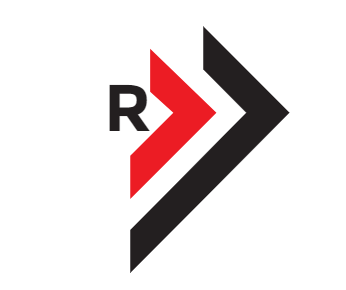

  

### Full Stack Developer

I build modern, scalable web applications using the **stack**:
**MongoDB, Express.js, React, and Node.js**.

---

### 🚀 About Me

💻 Passionate about building end-to-end web applications 
🛠️ Focused on clean architecture, reusable components, and RESTful APIs 
📚 Continuously learning and improving in full stack development 
🤝 Open to collaboration on MERN and JavaScript-based projects

---

### 🧰 Tech Stack
   -333?style=for-the-badge&logo=javascript(es6+)&logoColor=white)                       

---

### 📌 Currently Working On

⚡ Building full stack MERN projects 
⚡ Improving backend performance and API design 
⚡ Exploring advanced React patterns

---

### 📫 Let's Connect

  

---

### Visit my website

---

⚡ Secured first place at the NOSKATHONLITE Hackathon, demonstrating strong teamwork and rapid problem-solving skills.

  

